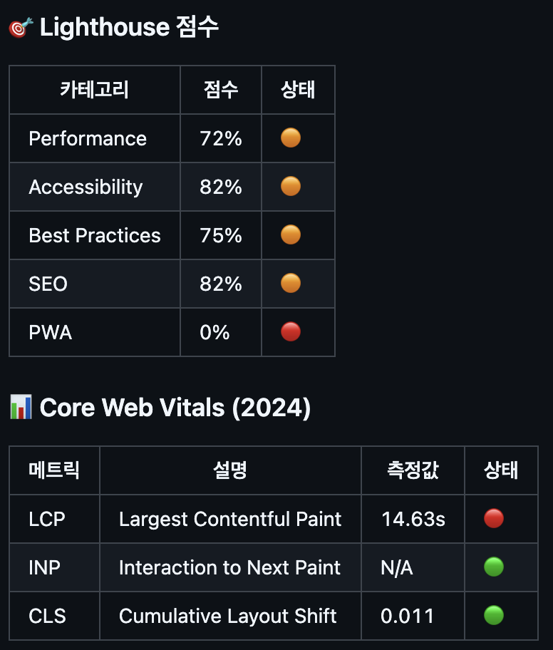
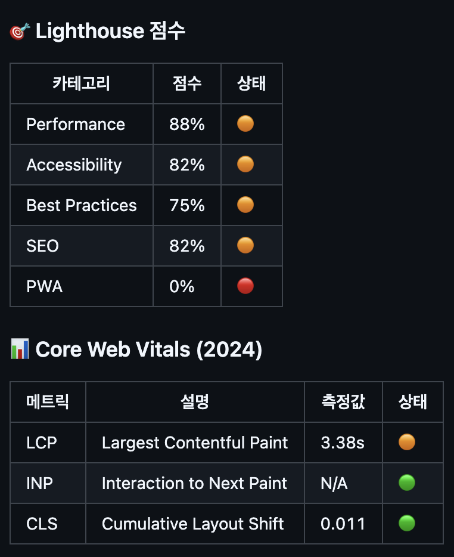
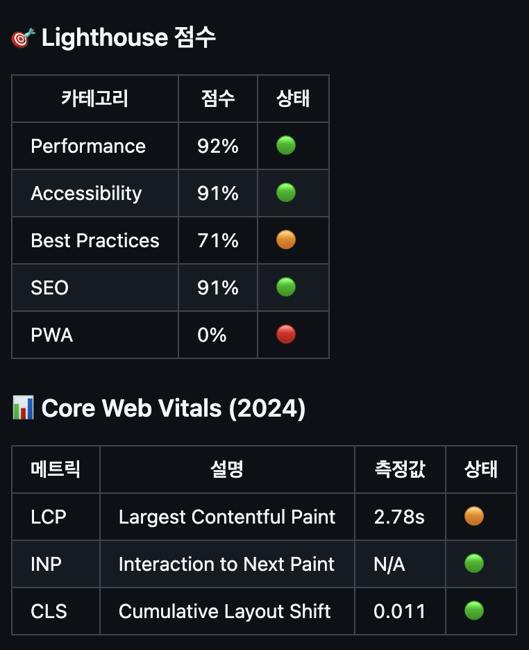
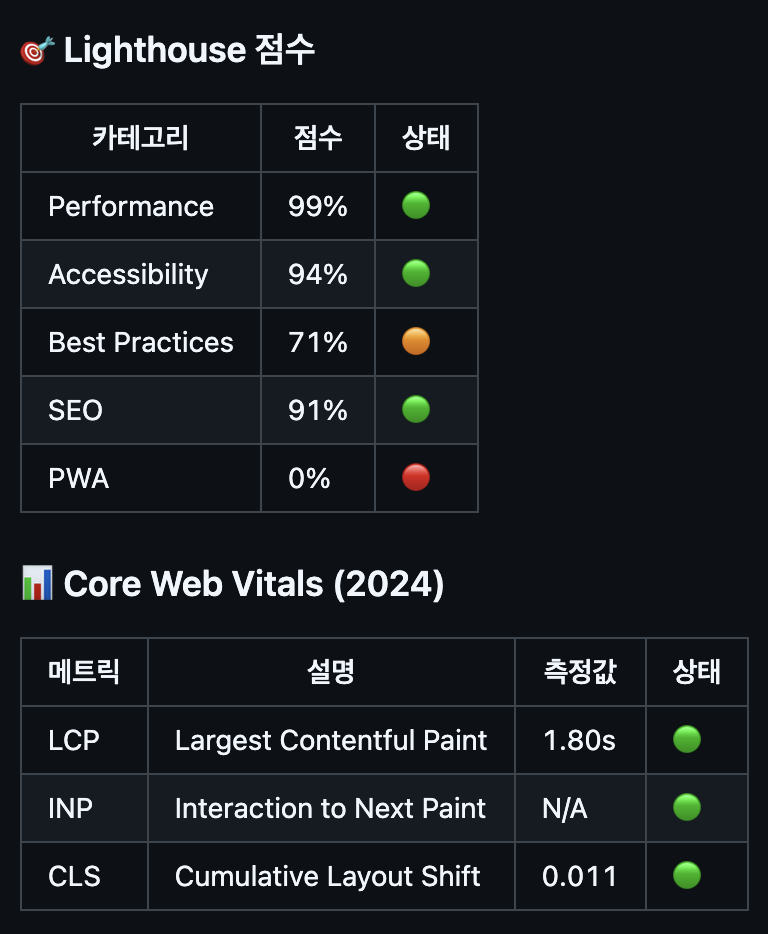
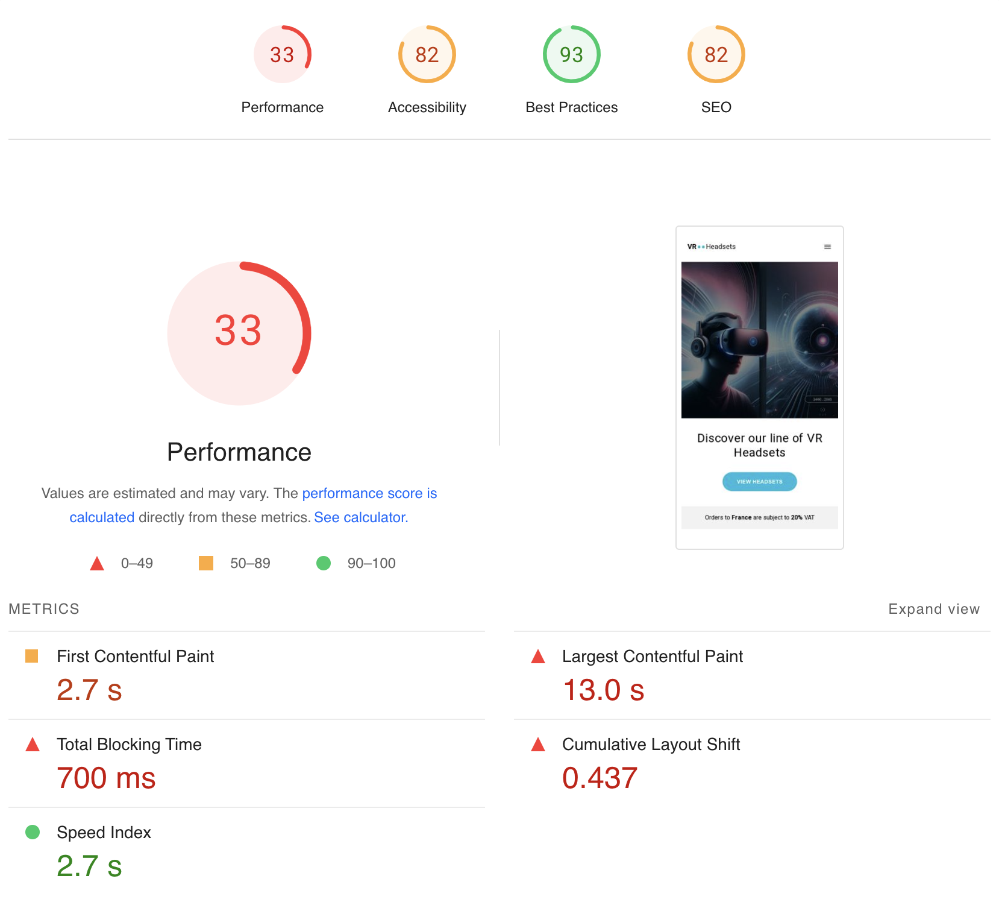
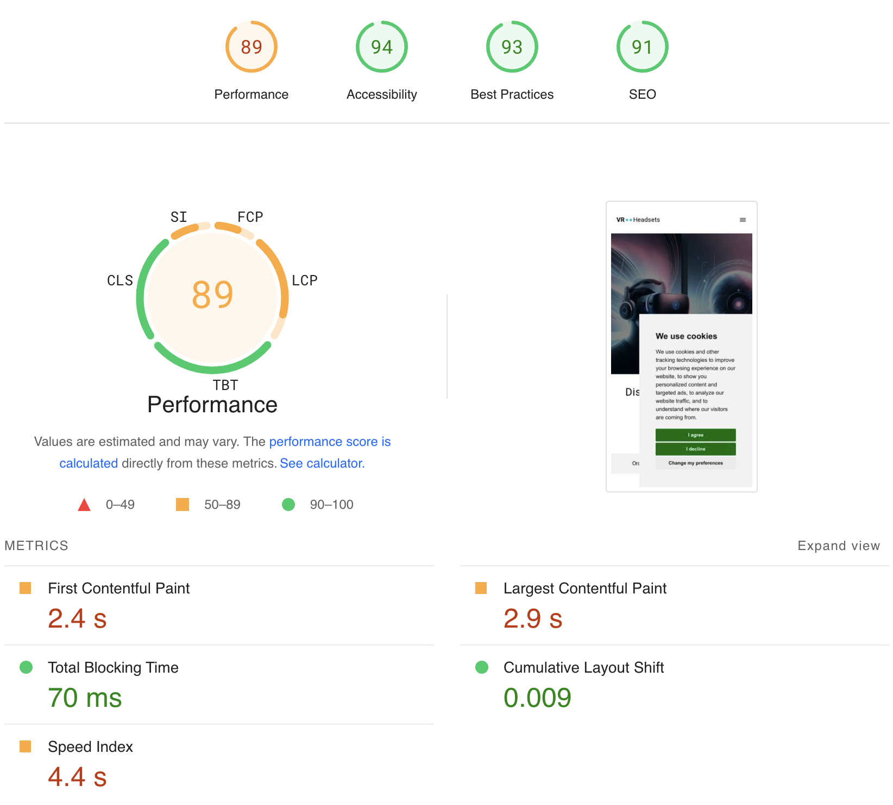
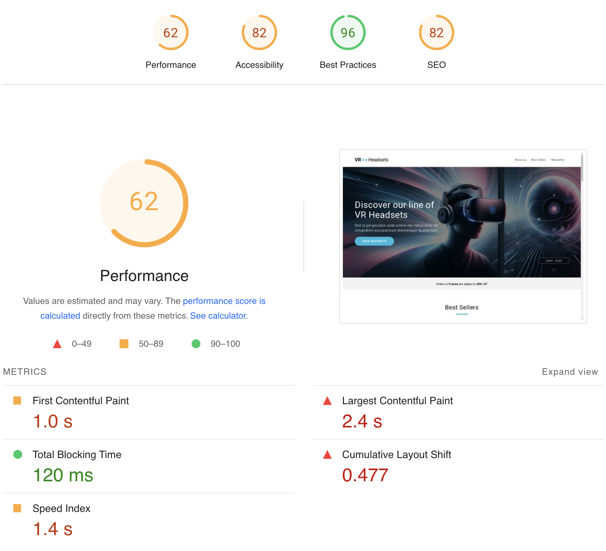
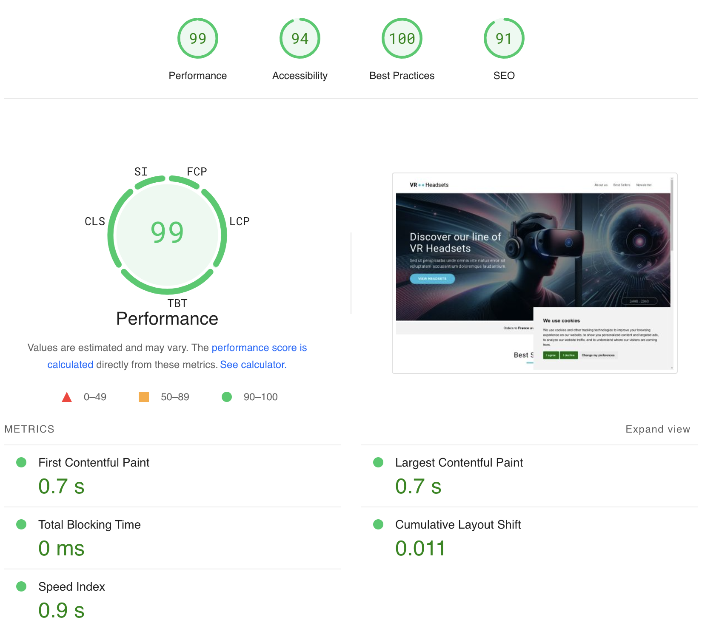

  
# 바닐라 JS 프로젝트 성능 개선
- url: [dsdvsylr6diuv.cloudfront.net](dsdvsylr6diuv.cloudfront.net)

## 목차
- [바닐라 JS 프로젝트 성능 개선](#바닐라-js-프로젝트-성능-개선)
  - [목차](#목차)
  - [성능 개선 보고서](#성능-개선-보고서)
    - [Light House - Performance](#light-house---performance)
    - [이미지 포멧 최적화](#이미지-포멧-최적화)
    - [`` + `@media` to `<picture>`](#img--media-to-picture)
    - [`` 명시적인 높이, 너비 추가 및 상품 이미지 지연 로딩](#img-명시적인-높이-너비-추가-및-상품-이미지-지연-로딩)
    - [초기 JS 실행시간 단축](#초기-js-실행시간-단축)
  - [PageSpeed Insights](#pagespeed-insights)
    - [Mobile](#mobile)
    - [Web](#web)

## 성능 개선 보고서

### Light House - Performance
1. First Contentful Paint (FCP)
   - 페이지가 로딩을 시작한 후 콘텐츠의 일부가 처음으로 화면에 렌더링되는 시점
   - 목표: 1.8초 이하

2. Largest Contentful Paint (LCP)
   - 가장 큰 콘텐츠 요소가 화면에 렌더링되는 시점
   - 목표: 2.5초 이하
   - 주요 영향 요소: 이미지, 비디오, 큰 텍스트 블록

3. Total Blocking Time (TBT)
   - FCP와 Time to Interactive 사이의 총 차단 시간
   - 목표: 200ms 이하
   - 메인 스레드가 입력 응답을 차단하는 시간의 합

4. Cumulative Layout Shift (CLS)
   - 페이지 로드 중 발생하는 예기치 않은 레이아웃 이동
   - 목표: 0.1 이하
   - 시각적 안정성 측정

5. Speed Index
   - 페이지 콘텐츠가 얼마나 빨리 시각적으로 표시되는지
   - 목표: 3.4초 이하

6. Time to Interactive (TTI)
   - 페이지가 완전히 상호작용 가능한 상태가 되는 시점
   - 목표: 3.8초 이하

### [이미지 포멧 최적화](https://github.com/temeraire97/front_3rd_chapter4-2_basic/commit/36190b71f21564d7342e1f784cd759723b33ab9f)
1. 개선 이유
   - .jpg 및 .png의 용량이 제법 컸다.
  
2. 개선 방법
   - .webp는 다른 이미지 포멧과 비교해 품질 대비 용량이 매우 작다.
   - images/의 이미지를 .webp로 전부 컨버팅

3. 지표
   - Performance
     - 72% > 88%
   - LCP
     - 14.63s > 3.38s

| [개선 전](https://github.com/temeraire97/front_3rd_chapter4-2_basic/issues/22) | [개선 후](https://github.com/temeraire97/front_3rd_chapter4-2_basic/issues/23) |
| ------------------------------------------------------------------------------ | ------------------------------------------------------------------------------ |
|                                    |                      |

### [`` + `@media` to `<picture>`](https://github.com/temeraire97/front_3rd_chapter4-2_basic/commit/e196948887f9d54649d2e595344a6055ef8ed54a)
1. 개선 이유
   - 화면너비와 관계없이 이미지를 전부 로드한다.
   - 로드 된 이미지를 `@media`에 따라 display를 조절한다.
  
2. 개선 방법
   - `<picture>`를 사용해 불필요한 이미지 로딩을 줄인다.****
   - `@media` 부분을 삭제해 css의 코드량도 줄인다.

3. 지표
   - **Performance**
     - 88% > 94%
   - LCP
     - 3.38s > 2.45s

| [개선 전](https://github.com/temeraire97/front_3rd_chapter4-2_basic/issues/23) | [개선 후](https://github.com/temeraire97/front_3rd_chapter4-2_basic/issues/24) |
| ------------------------------------------------------------------------------ | ------------------------------------------------------------------------------ |
|                      |                    |

### [`` 명시적인 높이, 너비 추가 및 상품 이미지 지연 로딩](https://github.com/temeraire97/front_3rd_chapter4-2_basic/commit/d5e01004a248d882ef61f666dfea5e8d29c5fcab)
1. 개선 이유
   - 이미지 태그에 명시적인 높이, 너비가 없어 레이아웃 시프트(CLS)가 발생한다.
  
2. 개선 방법
   - ``에 `loading="lazy"`를 추가

3. 지표 (어째서...?)
   - Performance
     - 94% > 92%
   - Accessibility
     - 82% > 91%
   - Best Practices
     - 75% > 71%
   - SEO
     - 82$ > 91%
   - LCP
     - 2.45s > 2.78s

| [개선 전](https://github.com/temeraire97/front_3rd_chapter4-2_basic/issues/24) | [개선 후](https://github.com/temeraire97/front_3rd_chapter4-2_basic/issues/25) |
| ------------------------------------------------------------------------------ | ------------------------------------------------------------------------------ |
|                     |             |

### [초기 JS 실행시간 단축](https://github.com/temeraire97/front_3rd_chapter4-2_basic/commit/f885d415086c7ae0d73c981710a63cbf98a66998)
1. 개선 이유
   - Simulate heavy operation. It could be a complex price calculation.
   - 뷰 포트에 없는 이미지를 로딩하는 방식은 LCP에 큰 영향을 준다.
   - `<script>`들이 비효율적으로 관리됨
  
2. 개선 방법
   - 무거운 작업 event loop(청크 단위로 쪼개 작업을 하는 방식) 적용
   - 상품을 불러오고 패치하는 api를 `windows.ononscroll` 이벤트를 통해 상품 리스트가 뷰 포트에 들어오면 동작하도록 변경
   - `<script>`에 defer 적용
     - 적용 전:
       - 파싱 차단(Parser Blocking)
         - HTML 파싱이 스크립트 태그를 만나면 즉시 중단됨
         - 스크립트 다운로드가 완료될 때까지 대기
         - 스크립트 실행이 완료될 때까지 대기
         - 그 후에야 HTML 파싱 재개
       - 실행 순서
         - HTML 문서 상단부터 순차적으로 실행
         - 각 스크립트는 이전 스크립트의 실행이 완료된 후에 실행
       - 영향
         - 페이지 로딩 시간 증가
         - 사용자가 콘텐츠를 보는 시간 지연
         - 초기 렌더링 속도 저하
     - defer/async:
       - 실행 시점
         - defer: HTML 파싱 완료 후, 순서 보장
         - async: 다운로드 완료 즉시 실행, 순서 보장 안됨
         - DOMContentLoaded 이벤트 발생 전에 실행
         - 스크립트들은 선언된 순서대로 실행
       - 동작 방식
         - HTML 파싱과 병렬로 스크립트를 다운로드
         - 파싱을 차단하지 않음
         - DOM 트리 구축 완료 후 실행

3. 지표
   - Performance
     - 92% > 99%
   - Accessibility
     - 91% > 94%
   - LCP
     - 2.78s > 1.80s

| [개선 전](https://github.com/temeraire97/front_3rd_chapter4-2_basic/issues/25) | [개선 후](https://github.com/temeraire97/front_3rd_chapter4-2_basic/issues/26) |
| ------------------------------------------------------------------------------ | ------------------------------------------------------------------------------ |
|              |                        |

## PageSpeed Insights
- 초기버전 대비 최종버전 지표 비교
- 
### Mobile
| 개선 전                                                                       | 개선 후                                                                     |
| ----------------------------------------------------------------------------- | --------------------------------------------------------------------------- |
|  |  |

### Web
| 개선 전                                                                         | 개선 후                                                                       |
| ------------------------------------------------------------------------------- | ----------------------------------------------------------------------------- |
|  |  |